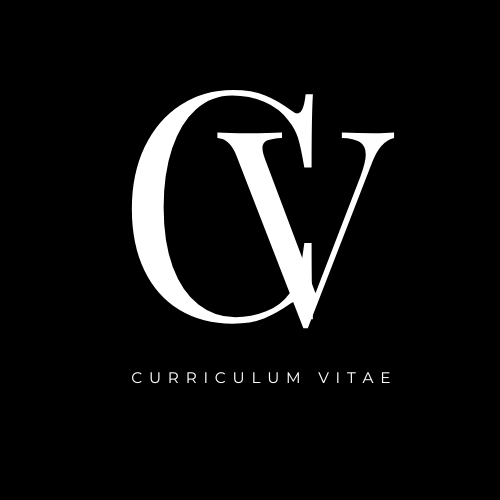

<!DOCTYPE html>
<html lang="es">
<head>
    <meta charset="UTF-8">
    <meta http-equiv="X-UA-Compatible" content="IE=edge">
    <meta name="viewport" content="width=device-width, initial-scale=1.0">
    <link rel="stylesheet" type="text/css" href="CSS/Estilo_celu.css"/>
    
    <link rel="icon" href="icono.ico">
    <title>Curriculum Vitae</title>
</head>
<body>
        <header>
            
            <nav>
                <ul>
                    <li><a href="#pantalla-1"> Datos Personal</a></li>
                    <li><a href="#Estudios">Estudios</a></li>
                    <li><a href="#pantalla-2">Proyectos</a></li>
                    <li><a href="#pantalla-3">Experiencia</a></li>
                    <li><a href="#contacto">contacto</a></li>
                </ul>

            </nav>
        </header>
        <main>
            <section id="pantalla-1">
                <section id="presentacion">
                    

                        
                    
                    

                    

                        
<b>Estudiante Avanzado de Ingeníera Electrónica con Orientación en Sistemas Digitales.</b> 
                        Pro activo, dispuesto y pronto a aprender y mejorar, para el bien propio y mejora de la empresa. 
                        Con perfil en estudios de factibilidad, dirección técnica, instalación, reparación, control, mantenimiento, modificación,
                        transformación e inspección de sistemas digitales en control, comunicaciones, sistemas de computación y redes. 
                        Estudios y asesoramiento en ingenieria legal, economica y financiera relacionados con la especialidad como: arbitrajes, pericias y tasaciones.

                        

                    

                </section>
                <section id="persona">
                    

                        <h2>Sosa Tula Martín Ignacio</h2>
                        <h1>Junior Developer</h1>
                        <b>Dirección:</b>
                        
Fatima 1309,5701, Juana Koslay

                        <b>Nacionalidad:</b>
                        
Argentina
  
                        <b>Lugar de Nacimiento:</b>
                        
San Luis
 
                        <b>Fecha de Nacimiento:</b>
                        
27/01/1996
 
                        <b>Sexo:</b>
                        
Masculino

                        <b>Estado Civil:</b>
                        
Soltero
 
                        <b>Permiso de Conducir:</b>
                        
Tipo B2
  
                        <b>Numero de Telefono:</b>
                        
2664887945

                        <b>Correo Electronico:</b>
                        
martin96.st@gmail.com
 
                        <b>Linkedin:</b>
                        <a href="http://linkedin.com/in/martin-sosa-tula">
                         Martin I. Sosa Tula
                        </a>
                    

                    

                        <h2>Estudios Realizados</h2>
                        <h4>Ingeiería Electrónica con orientación en sistemas digitales</h4>
                        
Universidad Nacional de San Luis    Feb 2014

                        
En curso, Nivel Avanzado

                        <progress value="70" max="100"></progress>
                        <h4>Profesorado en Tecnologia Electronica</h4>
                        
Universidad Nacional de San Luis   Mar 2020

                        
En curso, Nivel Avanzado

                        <progress value="60" max="100"></progress>
                        <h4>Tecnicatura Universitaria en Electrónica</h4>
                        
Universidad Nacional de San Luis   Mar 2021

                        
En curso, Nivel Avanzado

                        <progress value="90" max="100"></progress>
                        <h4>Ingles</h4>
                        
Universidad de la Punta,  Ene 2018

                        
En curso, Ene 2020

                        <progress value="40" max="100"></progress>
                        <h4>Bachiller en Economia y Gestión de las organizaciones</h4>
                        
Colegio Don Bosco, San Luis

                        
Secundario completo

                        <progress value="100" max="100"></progress>
                        

                            <h2>Habilidades</h2>
                            <li>Paquete office <progress value="70" max="100"></progress></li>
                            <li>Matlab  <progress value="50" max="100"></progress></li>
                            <li>Multisim <progress value="80" max="100"></progress></li>
                            <li>Arduino <progress value="40" max="100"></progress></li>
                            <li>Payton <progress value="10" max="100"></progress></li>
                            <li>ProfiCAD <progress value="40" max="100"></progress></li>
                            <li>AutoCAD <progress value="50" max="100"></progress></li>
                            <li>C, C++  <progress value="20" max="100"></progress></li>
                            <li>Wondershare Filmora <progress value="30" max="100"></progress></li>
                            <li>LOGO <progress value="40" max="100"></progress></li>
                            <li>Linux <progress value="15" max="100"></progress></li>
                            <li>Git <progress value="10" max="100"></progress></li>
                        

                    

                </section>
            </section>

            <section id="pantalla-2">
                
                    <h2>Proyectos Realizados</h2>
                
                <section class="division-1">
                    

                        <li>Escrutinio de Votos </li>
                        
                        
Programado en lenguaje C, UNSL año 2015

                    

                    

                        <li>Robot seguidor de Linea</li>
                        
                        
Programado en Arduino, UNSL, año 2017

                    

                </section>
                <section class="division-2">
                    

                        <li>Arranque Estrella Triangulo</li>
                        
                        
Usando contactores Siemens y detector de fase de la misma marca, UNSL, año 2021

                    

                    

                        <li>Reproductor de Musica</li>
                        
                        
Programado con Arduino, UNSL, año 2022

                    

                    

                        <li>Lisitación de servicio Triple Play en la Localidad V. Quebrada</li>
                        
                        
Proyecto de Comunicaciones, UNSL, año 2022

                    

                </section>
            </section>

            <section id="pantalla-3">
                <h2>Experiencia Laboral</h2>
                <section class="division-1">
                    

                        <li>Logatec srl</li>
                        
Junio 2022 - Enero 2023

                        <a href="http://www.logatec.com.ar/">Logatec S.R.L.</a> 
                    

                    

                        <li>Instalaciones electricas Domiciliarias</li>
                        
                        
Particular, 2014 - actualidad

                    

                    

                        <li>Automatismo de portones</li>
                        
                        
Particular, 2015 - actualidad

                    

                    

                        <li>Instalación alarmas Domiciliarias</li>
                        
                        
Particular, 2012 - actualidad

                    

                </section>
                <section class="division-2">
                    

                        <li>Instalación Camaras de seguridad</li>
                        
                        
Particular, 2017 - actualidad

                    

                    

                        <li>Programación de PLC</li>
                        
                        
Particular, 2021 - actualidad

                    

                    

                        <li>Reparación de electrodomesticos</li>
                        
                        
Particular, 2020 - actualidad

                    

                    

                        <li>Instalación y configuración de Radio enlaces</li>
                        
                        
Particular, 2021 - actualidad

                    

                </section>
                <section class="division-3">
                    

                        <li>Instalación de Control de Accesos</li>
                        
                        
Particular, 2022 - actualidad

                    

                    

                        <li>Repación y armado de PC</li>
                        
                        
Particular, 2019 - actualidad

                    

                </section>
                    
            </section>

            <section id="contacto">
                <h2>Contacto</h2>
                <form action="" name="formulario" method="get">
                    <label>Nombre:</label>
                    <input type="text" name="nombre" id="nombre" maxlength="30" placeholder="Ingresa tu nombre">
                    
                    <Label>Asunto:</Label>
                    <input type="text" name="asunto" id="asunto" maxlength="50" placeholder="Ingresa tu asunto">
                    
                    <label>Mensaje:</label>
                    <textarea name="area" id="area" cols="30" rows="10" placeholder="Escribe aquí"></textarea>
                    
                    <input type="submit" id="btn" name="btn" value="Enviar">
                </form>
                
            </section>

        </main>
        <!-- Pie de Pagina-->
        <footer class="pie-pagina">
            

                

                    <figure>
                        
                    </figure>
                

                

                    <h5>SIGUEME</h5>
                    

                        
                        
                        
                    

                

            

            

                <small>&copy; 2023 <b>CV</b> - Todos los Derechos Reservados</small>
            

        </footer>
        
</body>
</html>